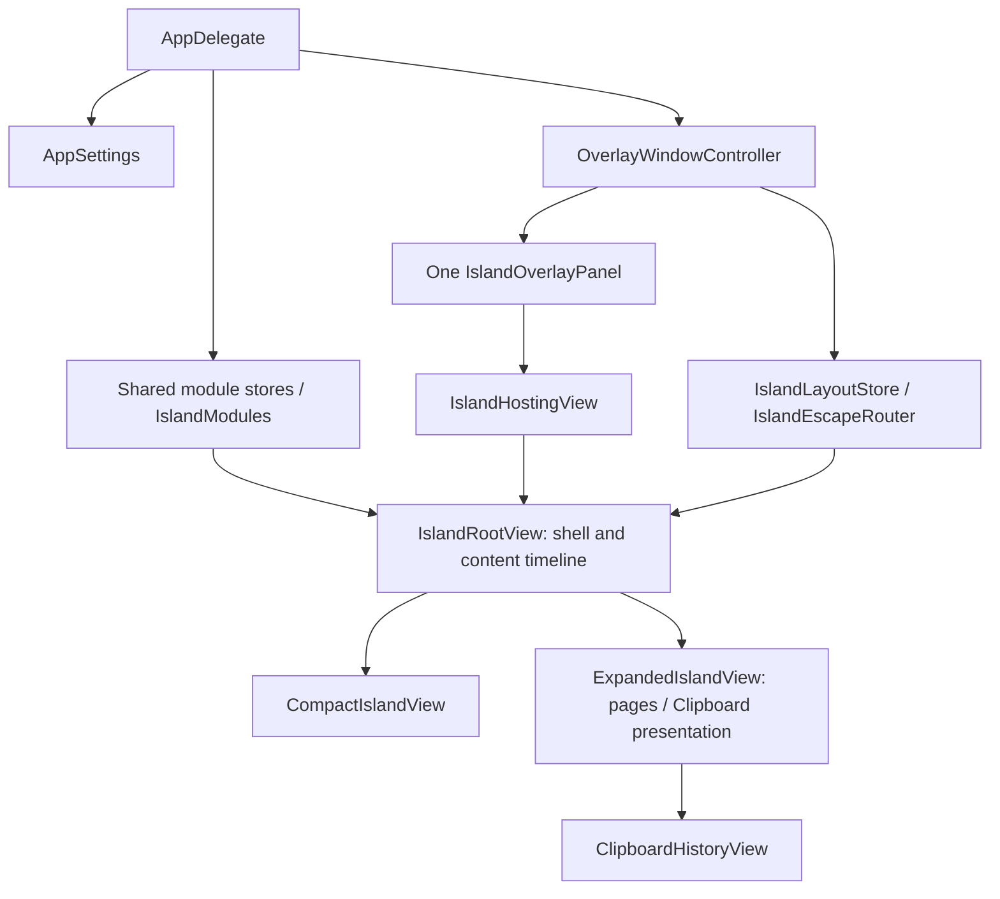

# Current architecture baseline

> Prepared 2026-09-19. Verified checkout: `df2bd0c29d06e8a01ec974459a118b232c8e22bc`, branch `phase-13c1-correctness-hotfix`. Local `origin/main` is `fbd1778ec025d9fa46d5f5f4f85c609b8375681b`; its Sources/, Tests/, Package.swift and Scripts/ match this HEAD. Only README differs (three removed lines). No checkout, pull or production edits were performed. `context.md` was already modified; historical evidence below includes that working-tree document. Source claims were checked in unchanged HEAD source. Recheck these summaries after implementation changes.

## Evidence and graph limits

Graphify outputs are in `graphify-out/`, not the repository root. Graph report records HEAD `df2bd0c2`: 1,948 nodes, 5,130 edges, 83 communities; all 57 tracked Swift files have graph source-file representation. This was local code-only extraction: documentation is not indexed, labels are placeholders, and imported-symbol ID collisions were reported. Post-build diagnostics report no missing/dangling endpoints and 28 self-loops; they cannot recover edges lost before serialization. Graph edges include inferred relationships and are navigation evidence, not proof of runtime behavior. For example the report attaches a test's `String` reference to IslandRootView; do not interpret that as an architectural dependency. No import cycles detected does not prove there is no coupling inside a single target.

Paths below are relative to `Sources/DynamicIsland/` unless stated otherwise. Function names are stable navigation anchors; lines are snapshot-specific.

## Composition, state and settings

| Subsystem / owner | Key files and state | Dependencies and flow |
|---|---|---|
| Process / AppDelegate | `App/DynamicIslandApp.swift`, `main`, `applicationDidFinishLaunching` | Explicit NSApplication entry, accessory policy, one set of settings/state/module instances; creates overlay, status menu and lazy settings controller. Screen/wake notifications reposition geometry. |
| Shared dependencies / AppDelegate | `Modules/IslandModule.swift`, `IslandModules` | Bundle of media, shelf, shortcuts, timer, stats, live activities, Clipboard and navigation; views receive these same instances. `IslandModule` is a protocol declaration, not an enforced package boundary. |
| Preferences / AppSettings | `State/AppSettings.swift`, main actor, Published preferences, UserDefaults, `normalizeAll`, `normalizeAndSaveDouble/Int` | Loads/migrates defaults, normalizes numeric settings with observer suppression, persists changes. Read across controller/services/views; launch-at-login and stats interval are bound in AppDelegate. |
| Presentation / IslandStateStore | `State/IslandStateStore.swift`, `.collapsed` / `.expanded` only | Coarse presentation state; no Clipboard/peek/animation phase enum cases. Controller state sink defers to main queue to read committed Published state. |
| Navigation / IslandNavigationStore | `State/IslandNavigationStore.swift`, selectedPage, file-drop targeting | Island/Tray/Timer/Stats availability from settings; default/fallback selection, adjacent-page gestures, Tray targeting on file drag. |
| Layout / OverlayWindowController | `Overlay/IslandLayoutStore.swift`, screen/panel-local frames, notch regions, shell/exiting/preview flags, transient scroll suppression | `updateLocal` converts coordinates against integral panel frame. Root consumes geometry and lifecycle; ExpandedIslandView updates Clipboard suppression. |
| Settings window / AppDelegate | `App/SettingsWindowController.swift`, `Views/SettingsView.swift` | Separate ordinary window hosts shared settings/shortcuts, switches app to regular on show and accessory on close. This window is separate from the one-panel island invariant. |

## Native overlay, geometry and input

`Overlay/OverlayWindowController.swift` owns one borderless nonactivating `IslandOverlayPanel` and one `IslandHostingView<IslandRootView>`. Configuration (`OverlayPersistence`, `configure`) is `.statusBar`, `[.fullScreenAuxiliary, .canJoinAllSpaces, .ignoresCycle]`, clear/nonopaque, no shadow, no hide on deactivate, not movable. Normal shell morphs use a stable host frame; genuine geometry updates apply physical frame changes without animation (`applyPhysicalPanelFrame`, finite checks and 0.35pt tolerance). No current Space-compensation probe/render panels or display-link correction system exists.

`Geometry/NotchGeometryService.swift` infers hardware notch from safeAreaInsets and auxiliary areas, prefers a notched screen, otherwise main/first screen and a snapshot fallback. Produces screen frames, canvas and activity-specific equal wings around an empty physical notch core. `IslandLayoutStore.updateLocal` supplies consistent coordinates to the view. Floating geometry has vertical offsets of 8pt collapsed and 10pt expanded. Hardware notch inference and the preference to respect that geometry are distinct inputs.

Interaction has two gates: controller `updateMousePassthrough` toggles window-level `ignoresMouseEvents` from the current surface rectangle plus tolerance; hosting `hitTest` also gates a local rectangle. Despite the historical "shape-aware" label, these native gates do not inspect the rounded shell path; exact visual-boundary behavior remains a later audit question. Expanded leave containment combines local/global movement monitors, hosting mouseExited, a grace interval and a 0.06s `.common` run-loop timer while expanded. The rectangle gate alone is not the whole click-through implementation.

Controller installs local/global mouse/scroll monitors plus one local key monitor. Local monitors may consume handled Island scroll events; hosting `scrollWheel` delegates to the same controller and otherwise calls super. Trackpad handling distinguishes collapsed media swipe sessions, immediate downward expansion, expanded mappings and expansion-tail protection (0.42s). `State/IslandGestureCoordinator.swift` resolves SwiftUI pointer gestures/settings/cooldown/context into callbacks; `IslandPointerGestureModifier` resides in root view. Clipboard is a sibling above the gesture-bearing expanded base, with native scroll pass-through while mounted.

## SwiftUI rendering and presentation

`Views/IslandRootView.swift`: IslandRootView owns the one continuous shell, shell progress and overall contentVisible timeline. CompactIslandView renders one collapsed winner; hover preview mounts separately only when active. ExpandedIslandView owns displayed/pending tab handoff and Clipboard's local requested/mounted/visible/removing/generation state, not the global shell timeline. `IslandShellShape` / `IslandShellRadii` drive background, stroke and clipping; `Views/IslandThemeBackground.swift` supplies theme background. `Views/ModuleViews.swift` contains shared module UI, artwork, simulated visualizer and file thumbnail support.

Clipboard opens inside the page region below the header, not a separate panel/popover/tab. `updateClipboardPresentation` synchronizes layout scroll suppression and topmost registration in the controller-owned `State/IslandEscapeRouter.swift`. AppKit Escape requests Clipboard dismissal first; only an unregistered expanded Island collapses. Removals keep registration/suppression until actual unmount. Other close triggers include page/settings changes, feature disablement, outer content exit and view disappearance.

## Media and artwork

Owner: `Modules/MediaController.swift`, main actor. Published session metadata, progress/control availability, selected source, raw artwork key/image/revision and flip request; owns one `ArtworkPresentationCoordinator`. Initialization refreshes and starts 0.75s media polling. `refresh` prevents overlapping provider passes, then `refreshFromProviders` awaits system snapshot and synchronously reads Spotify, Music and browser AppleScript candidates. This is candidate collection/arbitration, not a first-success-only provider cascade.

`Modules/MediaDetectionProvider.swift` defines snapshot/provider vocabulary. `NowPlayingMediaProvider.swift` dynamically loads private MediaRemote functions; missing framework/symbols return no snapshot. `YouTubeMetadataProvider.swift` is an actor caching async oEmbed/thumbnail results. `MediaArbitrator` prefers playing candidates, otherwise keeps current displayable identity or chooses deterministic fallback. `MediaPausedSwitchGate` confirms new paused identities; `MediaPublishGuard` checks identity plus publication generation before async enrichment/artwork is applied. Browser sessions expose only supported control capabilities.

Raw selected artwork feeds `synchronizeArtworkPresentation` synchronously. Pure `ArtworkFlipPresentationState` plus coordinator own displayed/pending/queued snapshots and callback generation. Both compact and expanded `FlippingAlbumArtworkView` render the coordinator snapshot/rotation. Visualizer accent uses presented artwork, not incoming raw artwork. `ArtworkAccentColorExtractor.swift` supplies color extraction/cache.

## Activities and utility modules

| Subsystem / owner | Key files / state | Event/data flow |
|---|---|---|
| Live Activities / AppDelegate + LiveActivityStore | `Modules/LiveActivityStore.swift`, activities sorted by priority/time/title; pure collapsed selector | AppDelegate observes timer/media/shelf/settings, refreshes battery every 60s. Global engine toggle and expanded display-only toggle remain independent. Selector picks one regular collapsed winner; preview can show more. |
| Timer / TimerController | `Modules/TimerController.swift`, total/remaining seconds, running, Task | Start/pause/resume/reset/stop; async one-second sleep/decrement loop; Combine feeds activity updates. |
| Battery / BatteryActivityProvider | `Modules/BatteryActivityProvider.swift`, IOKit snapshot and eligibility/state resolver | Battery readings feed AppDelegate activity update; missing/ineligible state removes the battery activity. Independent of demand-driven Stats timer. |
| Shelf / FileShelfStore | `Modules/FileShelfStore.swift`, URL array, optional UserDefaults bookmarks | Validates existing file URLs, standardizes/deduplicates/caps; optional restore/save bookmarks, UI drop accumulation. `AirDropService.swift` uses native sharing service with configured Finder fallback in UI. |
| Shortcuts / ShortcutsStore | `Modules/ShortcutsStore.swift`, Codable shortcut array in UserDefaults | Seed defaults, edit/save, open via `App/AppLaunchService.swift`; resolver focuses/launches supported apps and arbitrary targets. |
| Stats / SystemStatsController | `Modules/SystemStatsController.swift`, snapshot and histories, private native provider | Initial snapshot; timer starts only for actually visible rendered Stats page via ExpandedIslandView.synchronizeStatsPolling, stops on exit/disappear. Refresh interval 0.5...10s, default 2s. Native Mach/filesystem/network/IOKit reads are synchronous. |

## Clipboard engine and persistence

Owner: one AppDelegate `Modules/ClipboardHistoryStore.swift`, main actor. `Modules/ClipboardPasteboardClient.swift` defines injectable main-actor client, payloads, limits, canonical SHA256 fingerprints and real NSPasteboard client. Enabled monitoring baselines changeCount, then polls every 0.5s in `.common` mode. Marker filtering precedes files → images → URLs → text extraction; store validates/deduplicates/promotes/prunes, then publishes entries. Successful copy-back baselines the resulting count, promotes the same UUID and persists; failed writes do not promote.

Defaults: monitoring off, persistence off, image capture on when monitoring is enabled, 50 items (normalized 10...200). Limits: 2 MiB plain text; 1 MiB each RTF/HTML; 8 MiB normalized PNG; 100 files; 16 KiB URL; 64 MiB aggregate payload. Bounds describe retained data, not a proven peak-memory bound during decoding.

`Modules/ClipboardHistoryPersistence.swift`: schema-1 JSON in Application Support/DynamicIsland/clipboard-history.json. Load/decode/revalidate/refingerprint/deduplicate/prune executes synchronously in the store. Store JSON-encodes before submitting Data to the private serial utility writer; writer uses lock-protected generation checks and atomic writes/deletes. Invalid archive/schema is ignored. Payloads are not stored in UserDefaults. No encryption is implemented.

`Views/ClipboardHistoryView.swift` observes entries, resolves row descriptions, uses a finite native ScrollView/LazyVStack, fixed header/confirmation, one copied checkmark with generation-guarded reset, and a 24-entry memory thumbnail cache. File descriptions omit parent paths.

## Build and tests

Root `Package.swift`: tools version 6.0, macOS 14 package platform, one executable target plus one test target, processed Assets.xcassets, no external package dependencies. `Scripts/package_app.sh` release-builds, replaces dist/DynamicIsland.app, copies resource bundles, writes LSUIElement/AppleEvents usage metadata with minimum macOS 14.6, clears extended attributes and signs (Developer ID if provided, otherwise ad hoc). No packaging/build/test run was performed during this documentation phase.

Tests cover pure state/policies, geometry, settings, arbitration/guards/artwork reducer, activities/battery/files/stats and injectable/named pasteboard flows. Test presence does not establish AppKit UI/Spaces/manual coverage or current passing status.
